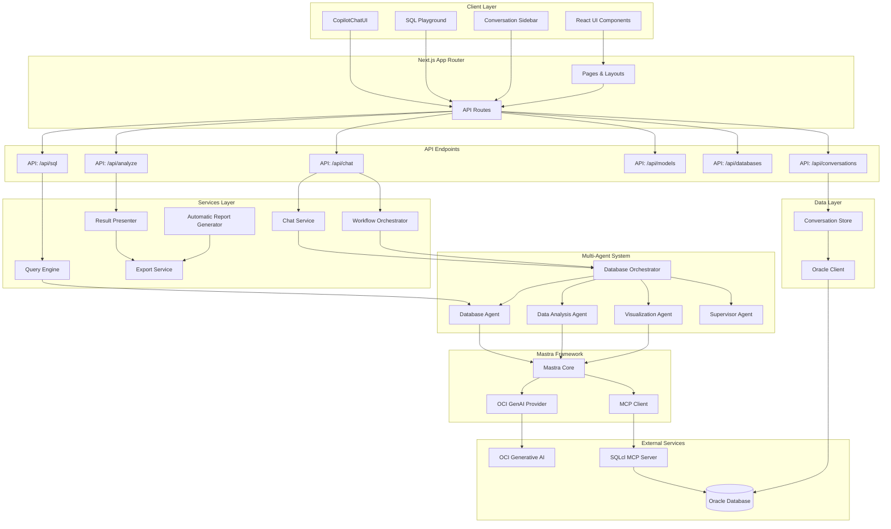
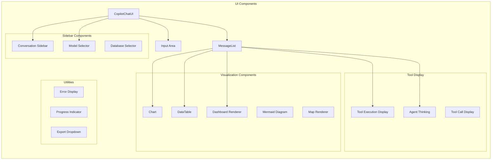
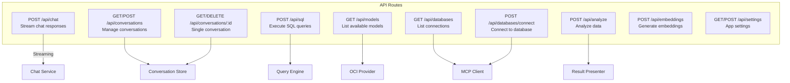
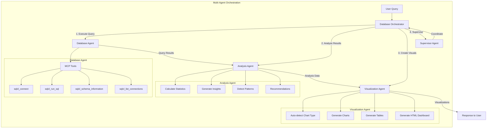
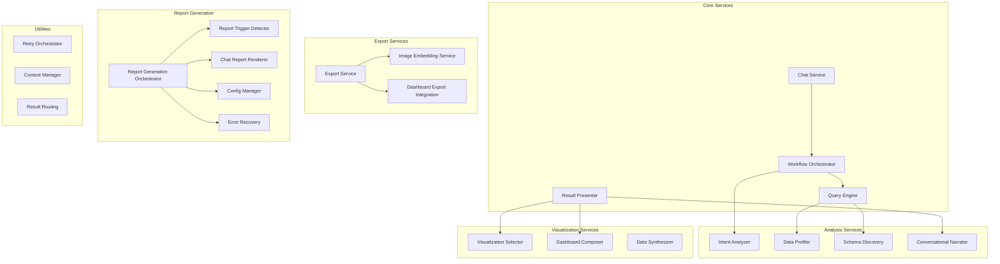
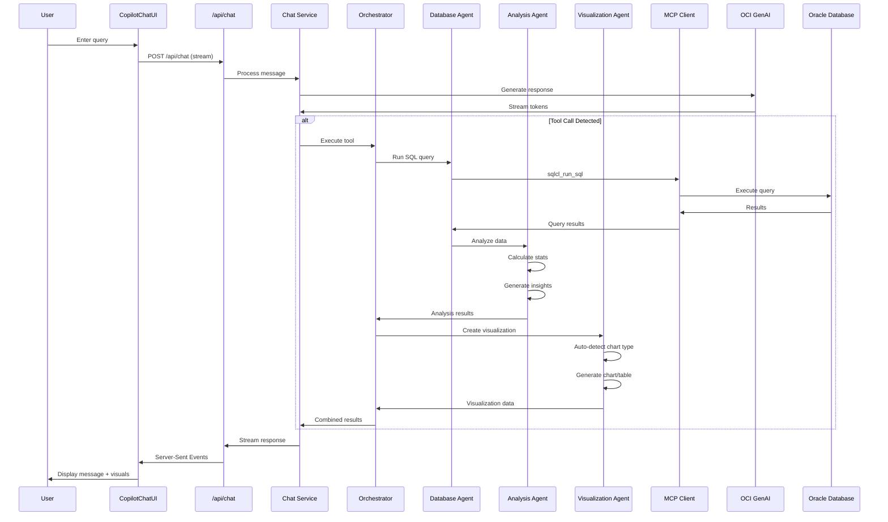
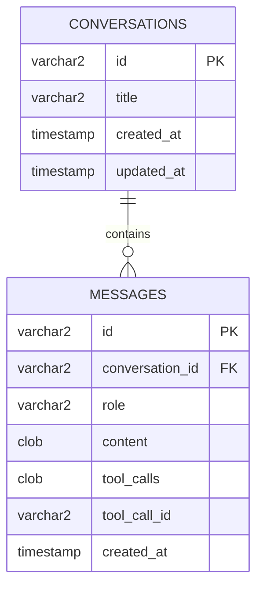
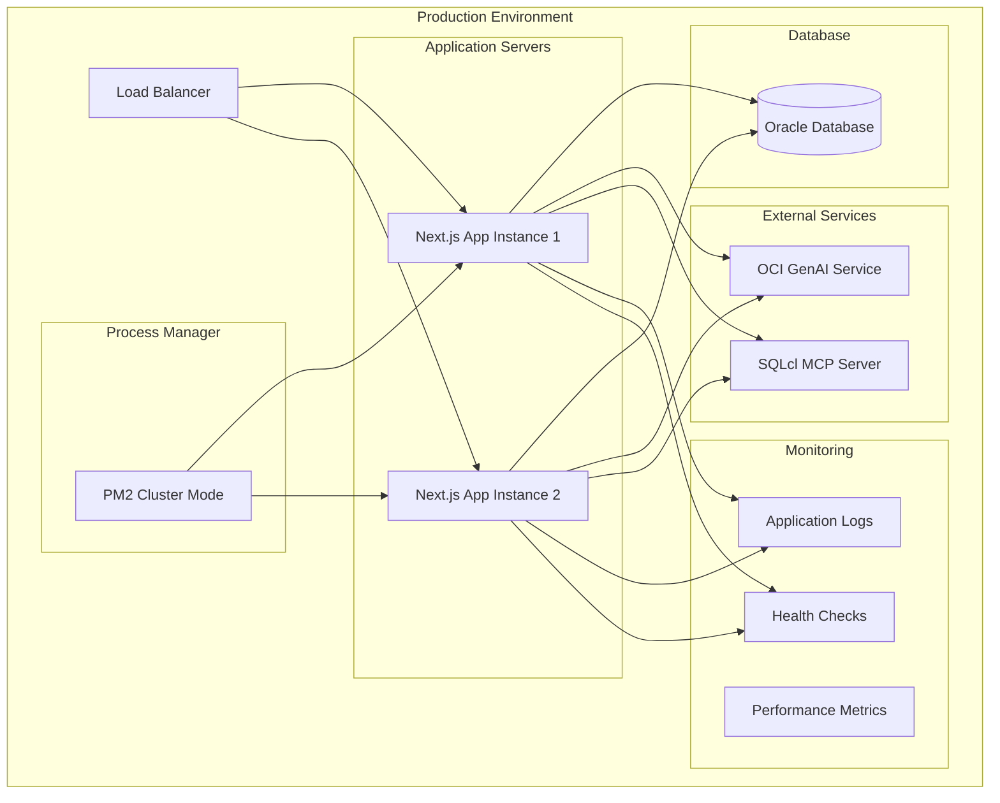

# Mastra App - Architecture Diagram

## System Overview

The Mastra App is a Next.js-based AI chat application that integrates Oracle Cloud Infrastructure (OCI) Generative AI with a multi-agent system for intelligent database exploration, analysis, and visualization.

## High-Level Architecture

## Detailed Component Architecture

### 1. Frontend Layer

### 2. API Routes Architecture

### 3. Multi-Agent System Architecture

### 4. Service Layer Architecture

### 5. Data Flow Architecture

### 6. Database Schema

## Technology Stack

### Frontend
- **Framework**: Next.js 16 (App Router)
- **Language**: TypeScript
- **UI Library**: React 19
- **Styling**: Tailwind CSS 4
- **Charts**: Recharts
- **Markdown**: react-markdown, rehype-highlight
- **Diagrams**: Mermaid
- **Maps**: Leaflet, react-leaflet

### Backend
- **Runtime**: Node.js 18+
- **Framework**: Next.js API Routes
- **AI Framework**: Mastra Core
- **MCP Client**: @mastra/mcp
- **OCI SDK**: oci-generativeaiinference, oci-common
- **Database**: oracledb

### Testing
- **Test Framework**: Vitest
- **Property Testing**: fast-check
- **Testing Library**: @testing-library/react
- **DOM Testing**: jsdom

### External Services
- **AI Provider**: OCI Generative AI
- **MCP Server**: SQLcl MCP Server
- **Database**: Oracle Database

## Key Features

### 1. Multi-Agent Intelligence
- Database operations and SQL execution
- Automatic data analysis and insights
- Automatic visualization generation
- Coordinated multi-step workflows

### 2. Rich Visualizations
- Auto-detected chart types (bar, line, pie, scatter)
- Interactive data tables with sorting
- HTML dashboards with filtering
- Mermaid diagrams
- Geographic maps

### 3. Conversation Management
- Persistent conversation history
- Search and filter conversations
- Message threading
- Context preservation

### 4. Export Capabilities
- CSV export
- Excel export with formatting
- HTML export (self-contained)
- Image embedding in exports

### 5. Automatic Report Generation
- Trigger detection from user queries
- Multi-page report generation
- Chart and table integration
- Error recovery and retry logic

### 6. Developer Experience
- Comprehensive test coverage (unit, integration, property-based)
- Type-safe TypeScript throughout
- Modular service architecture
- Extensible agent system

## Deployment Architecture

## Security Considerations

1. **Authentication**: OCI credentials via config file
2. **Authorization**: Compartment-based access control
3. **Data Protection**: HTTPS for all external communications
4. **SQL Injection**: Parameterized queries via SQLcl
5. **Environment Variables**: Sensitive data in .env files
6. **Database Security**: Oracle Database native security features

## Performance Optimizations

1. **Streaming Responses**: Real-time token streaming for better UX
2. **Connection Pooling**: Reuse database connections
3. **Caching**: Model list and schema information caching
4. **Lazy Loading**: Components loaded on demand
5. **Code Splitting**: Next.js automatic code splitting
6. **PM2 Cluster Mode**: Multi-process for production

## Scalability

1. **Horizontal Scaling**: Multiple Next.js instances behind load balancer
2. **Stateless Design**: No server-side session state
3. **Database Persistence**: All state in Oracle Database
4. **MCP Server**: Separate process for database operations
5. **OCI GenAI**: Managed service with auto-scaling

## Future Enhancements

1. **Additional AI Models**: Support for more OCI models
2. **Advanced Analytics**: ML-powered insights
3. **Collaboration**: Multi-user conversations
4. **Real-time Updates**: WebSocket for live data
5. **Custom Visualizations**: User-defined chart types
6. **API Gateway**: Rate limiting and authentication
7. **Caching Layer**: Redis for performance
8. **Observability**: Distributed tracing and monitoring

---

**Last Updated**: March 2026
**Version**: 0.2.0
